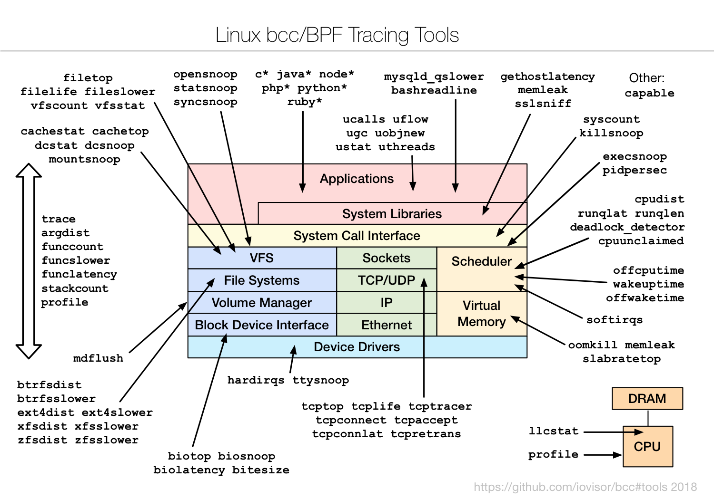

# eBPF Theory

## Linux Performance Analysis

### 1. uptime

This returns data in the following format:

* current time
* uptime
* number of users logged in
* load avg (in the format: last 1 min, last 5 min, last 15 min)

> **Note:** If the number is below your CPU core count (e.g., below 6 for a 6-core CPU), your system is generally comfortable. Higher numbers mean more tasks are waiting.

### 2. dmesg | tail

This views the last 10 system messages, if there are any. It can show errors that can cause performance issues.

### 3. vmstat 1

This is a real-time snapshot of the system's health, refreshed every second.

Key columns:

* procs (Processes):
  * r (running/ waiting): Processes ready for CPU. 0 or 1 is fine.
  * b (blocked): Processes stuck waiting. 0 is ideal.
* cpu (CPU Usage):
  * us (user): Time on your programs.
  * sy (system): Time on OS tasks.
  * id (idle): CPU free time.
  * wa (I/O wait): CPU waiting for disk. 0% is ideal.
  * st: Stolen time. 0% is ideal.
* memory & swap:
  * swpd: Used swap space.
  * free: Free RAM.
  * si/so: Swap-ins/outs. Both 0 means no current swapping.

### 4. mpstat -P ALL 1

This command prints CPU usage per CPU every second, which can be used to check for an imbalance. A single hot CPU can be evidence of a single-threaded application.

Key Columns:

* CPU:  Core number. all = total average.
* %usr: User programs (apps).
* %sys: Operating system tasks.
* %iowait: CPU waiting for disk/network. 0.00 is good.
* %irq & %soft: Hardware & software interrupt handling.
* %idle: Time spent by CPU doing nothing.

### 5. pidstat 1

Pidstat is a little like top’s per-process summary, but prints a rolling summary instead of clearing the screen.

**%usr** + **%system** = **%CPU** for each process (**PID**), showing which core (**CPU**) it's using and how much it's waiting (**%wait**).

### 6. iostat -xz 1

This is a great tool for understanding block devices (disks), both the workload applied and the resulting performance.

* **r/s, w/s, rkB/s, wkB/s**: These are the delivered reads, writes, read Kbytes, and write Kbytes per second to the device. Use these for workload characterization. A performance problem may simply be due to an excessive load applied.
* **await**: The average time for the I/O in milliseconds. This is the time that the application suffers, as it includes both time queued and time being serviced. Larger than expected average times can be an indicator of device saturation, or device problems.
* **avgqu-sz**: The average number of requests issued to the device. Values greater than 1 can be evidence of saturation (although devices can typically operate on requests in parallel, especially virtual devices which front multiple back-end disks.)
* **%util**: Device utilization. This is really a busy percent, showing the time each second that the device was doing work. Values greater than 60% typically lead to poor performance (which should be seen in await), although it depends on the device. Values close to 100% usually indicate saturation.

### 7. free -m

It shows RAM and Swap usage in megabytes.

### 8. sar -n DEV 1

This shows network activity per second for each interface (like wlan0 for WiFi, eth0 for Ethernet).

Key Columns:

* **rxpck/s**: Packets received per second.
* **txpck/s**: Packets sent per second.
* **rxkB/s**: Data received (KB) per second.
* **txkB/s**: Data sent (KB) per second.

### 9. sar -n TCP,ETCP 1

This shows TCP connection and error rates per second.

First row (TCP connections):

* **active/s**: Number of Local apps starting connections.
* **passive/s**: Number of Remote apps connecting to you.
* **iseg/s** & **oseg/s**: Number of TCP packets received and sent.

Second row (TCP errors):

* **retrans/s**: Retransmitted packets. 0.00 is ideal.
* **atmptf/s**: Failed connection attempts.

### 10. top

top shows a real-time, sorted list of processes using the most CPU and memory. It's your primary dashboard for immediate system performance, showing overall resource usage and allowing interactive management.

## BCC Tools - General Performance

### 1. execsnoop

execsnoop prints one line of output for each new process.

Columns:

* **PCOMM**: Process name (e.g., docker).
* **PID**: Process ID.
* **PPID**: Parent Process ID.
* **RET**: Return code (0 means success).
* **ARGS**: Full command executed.

> **Note:** It works by tracing exec(), not the fork(), so it will catch many types of new processes but not all (eg, it won't see an application launching working processes, that doesn't exec() anything else).

### 2. opensnoop

This tool shows every file opened on the system in real-time.

Key columns:

* **PID**: Process ID opening the file.
* **COMM**: Command/process name.
* **FD**: File descriptor number.
* **PATH**: Full path of the file being accessed.

### 3. ext4slower (or btrfs*, xfs*, zfs*)

ext4slower traces the ext4 file system (the default Linux filesystem) and times common operations, and then only prints those that exceed a threshold.

Key columns:

* COMM: Process name causing the slow I/O.
* T: Type: Read, Write, or Sync.
* LAT(ms): Latency in milliseconds (how long it took). The key number.
* FILENAME: File being accessed.

### 4. profile

profile is a CPU profiler, which takes samples of stack traces at timed intervals, and prints a summary of unique stack traces and a count of their occurrence.

### 5. tcpconnect

tcpconnect prints one line of output for every active TCP connection (eg, via connect()), with details including source and destination addresses.

Key columns:

* PID & COMM: Process ID and name making the connection.
* SADDR: Source IP address (your machine).
* DADDR: Destination IP address (where it's connecting to).
* DPORT: Destination port (e.g., 443 for HTTPS, 80 for HTTP).

### 6. tcpaccept

tcpaccept prints one line of output for every passive TCP connection (eg, via accept()), with details including source and destination addresses.

Key columns:

* **PID** & **COMM**: Process ID and name making the connection.
* **RADDR**: Remote IP address (the client connecting to you).
* **RPORT**: Remote port (client's port).
* **LADDR**: Local IP address (your machine's IP).
* **LPORT**: Local port (the port your service is listening on).

### 7. tcpretrans

tcpretrans prints one line of output for every TCP retransmit packet, with details including source and destination addresses, and kernel state of the TCP connection.

Key columns:

* **LADDR:LPORT**: Your local IP and port.
* **RADDR:RPORT**: Remote IP and port.
* **STATE**: TCP connection state at the time of retransmit.
